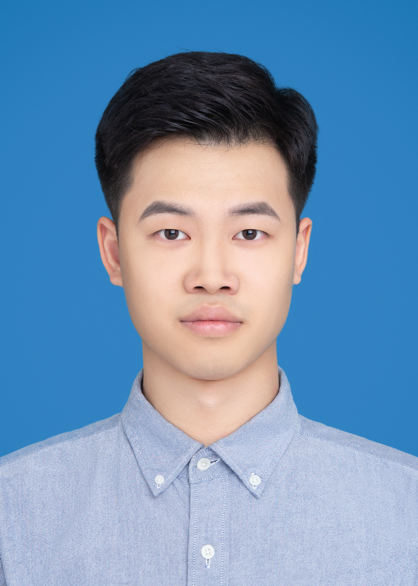

# Songyun Qu (屈松云)

### Short Bio
I am currently a fourth-year(at 2022) PhD candidate in Institute of Computing Technology, Chinese Academy of Sciences. My research interests primarily focus on Process in Memory (PIM)-systems, Energy Efficient NN Accelerator, Software/Hardware Co-Design, VLSI Design and AutoML.

**Email**: qusongyun18z@ict.ac.cn

**Wechat**: qusongyun

**Tel**: +8618811542553

### Education
+ Sep. 2018 - Present: ICT, CAS.   PhD Student in Computer Systems and Architecure
+ Sep. 2014 - Jun. 2018: Wuhan University.   B.E. in Electronic and Information Engineering

### Publications
1. [**DAC'22**] **Yintao He, Songyun Qu(共一)**, Ying Wang, Bing Li, Huawei Li, Xiaowei Li, “InfoX: An Energy-Efficient ReRAM Accelerator Design with Information-Lossless Low-Bit ADCs”, to appear in IEEE/ACM Proceedings of Design, Automation Conference, 2022.(**CCF-A**)
2. [**DAC'22**] Yuquan He, **Songyun Qu**, Gangliang Lin, Ying Wang, ChengLiu, LeiZhang, “Processing-in-SRAM Acceleration for Ultra-Low Power Visual 3DPerception”, to appear in IEEE/ACM Proceedings of Design, Automation Conference, 2022.(**CCF-A**)
3. [**DAC'21**] **Sonyun Qu**, Bing Li, Ying Wang, Lei Zhang, “ASBP: Automatic Structured Bit-Pruning for RRAM-based NN Accelerator,” in IEEE/ACM Proceedings of Design, Automation Conference, 2021.(**CCF-A**)
4. [**DAC'20**] **Sonyun Qu**, Ying Wang, Bing Li, Xiandong Zhao, Dawen Xu Lei Zhang, “RaQu: An Automatic High-Utilization CNN Quantization and Mapping Framework for General-purpose RRAM Accelerator,” in IEEE/ACM Proceedings of Design, Automation Conference, 2020.(**CCF-A**)
5. [**TCAD'21**] Bing Li, **Songyun Qu**, Ying Wang, "An Automated Quantization Framework for High-utilization RRAM-based PIM,” in IEEE Transactions on Computer-Aided Design of Integrated Circuits and Systems, doi: 10.1109/TCAD.2021.3061521, 2021.(**CCF-A**)
6. [**TC'21**] Kaiwei Zou, Ying Wang, Long Cheng, **Songyun Qu**, Huawei Li, and Xiaowei Li, "CAP: Communication-aware Automated Parallelization for Deep Learning Inference on CMP Architectures,” in IEEE Transactions on Computers, 2021.(**CCF-A**)

### Honors and Awards
+ 2022: ASP-DAC Student Research Forum(SRF), **most popular poster award**
+ 2021: 第六届ChinaDA 会议，主题报告
+ 2020: UCAS Merit Student
+ 2020: DAC 2020 Young Fellow Member
+ 2016: **First Prize** of National College Student Electronic Design Contest - Analog Electronic System Design Invitation Contest
+ 2017: **First Prize** of National College Student Electronic Design Contest
